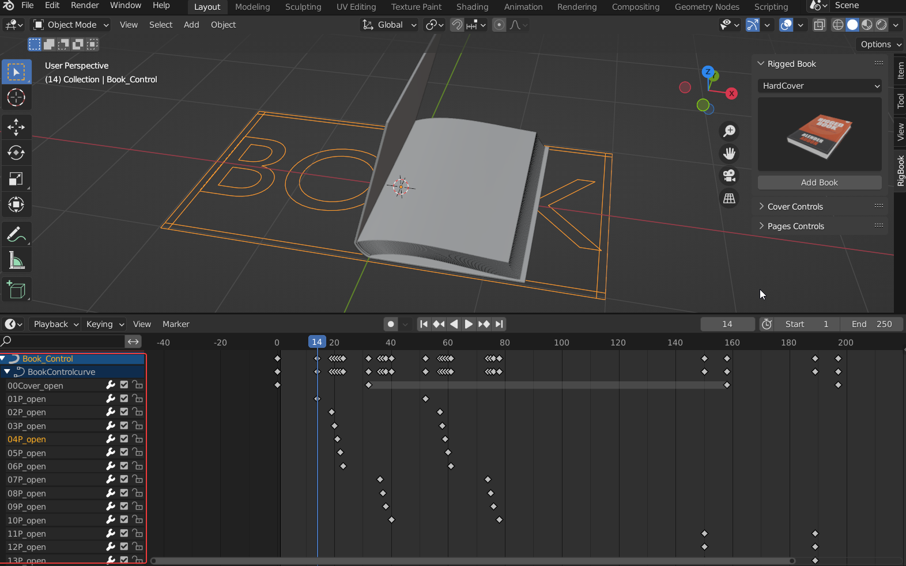
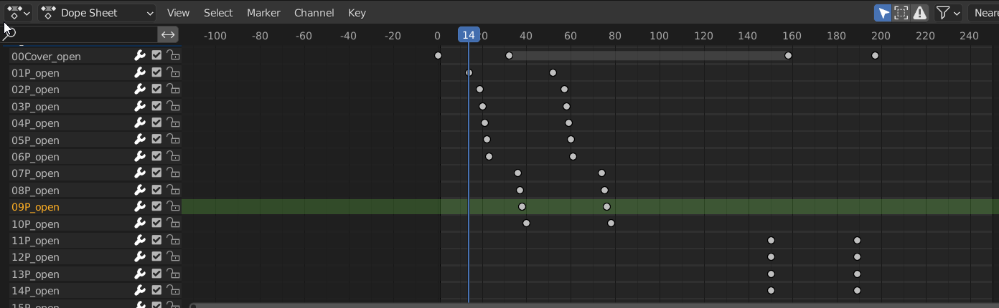
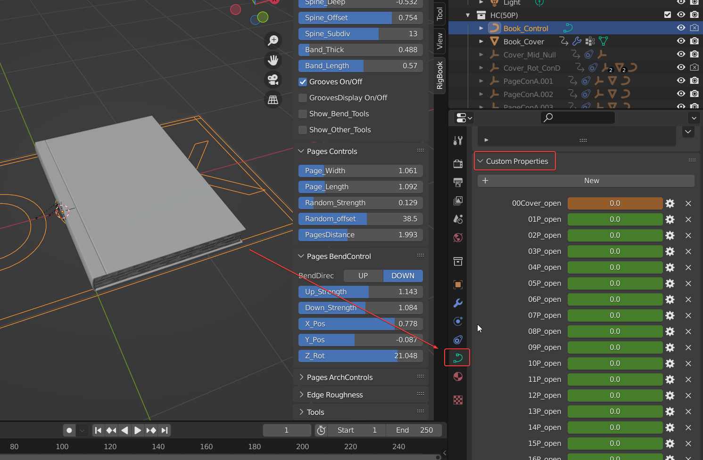
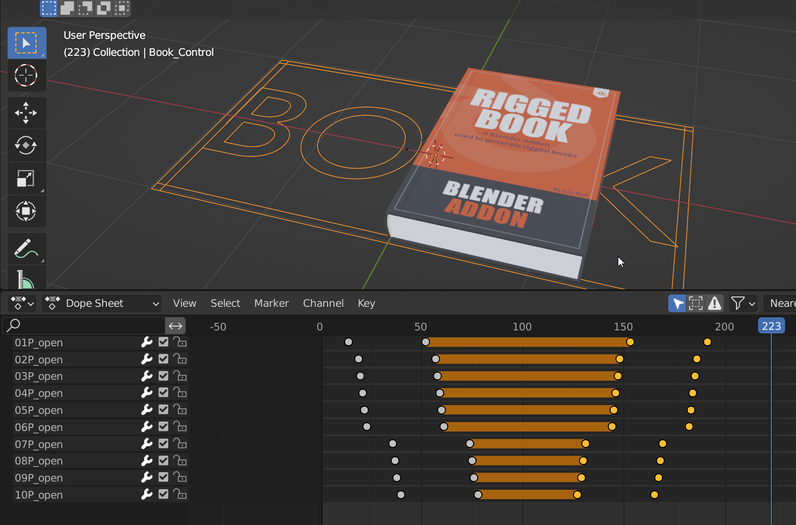

# Animations

**After adding a book from preset, play the timeline, you'll see the pre-set flip animation。**

With the controller selected, you can see the animation keyframes for  the cover and each page in the timeline。

Cover and each page has its own key frames that controls its opening animation。Each page has two key frames that control the page from rest to 180 ° .00Cover_open, for example, controls the opening animation of the cover.01P_open controls the opening animation of the first page.And so on,all you need to do is adjust the position of the keyframe。

It is recommended to press SHIFT + F12 on the timeline panel to switch to the dopesheet interface，because in this panel，when you select the attributes at left，The corresponding key frame will be highlighted，You Won't be dazzled by a lot of key frames.

!!!note "Note the Order of page keys"
	Be sure to pay attention to the order of the pages' key frames，the starting frame of the last page is behind the starting frame of the previous page,the end frame follows the end frame of the previous page，for example，Don't let the second page start turning over before the first page，Otherwise, there will be interlacing problems。

!!!note "How to get it back when you accidentally delete a keyframe?"
	Select the controller, in the controller's custom properties, there are all parameters, find the required parameter to key frame。
	

!!!note "How to make a cover flip back animation?"
	Delete the keyframes in the end. Mirror the front keyframes.
	