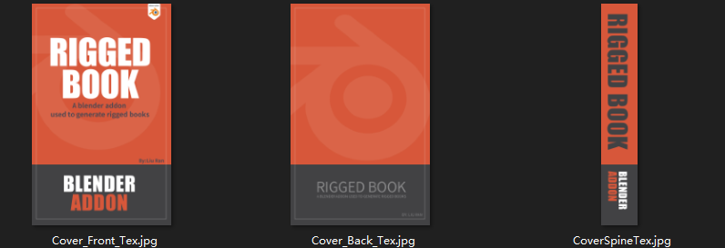
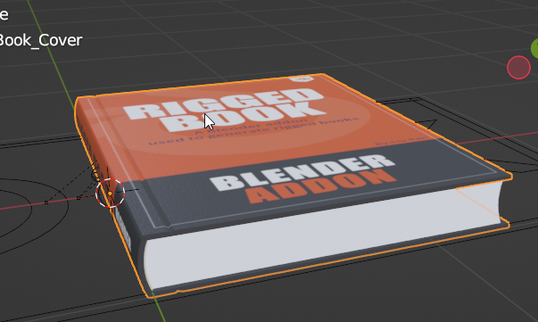

# Manual replace textures

**Change the cover tex：You need to prepare three JPG images **：  
Similar to the following, respectively corresponding to the book cover front, back and side：

	

**Cover textures：**select cover model，it has five materials，control different parts of the cover.
	

**Cover_Front_Mat：**cover front

**Cover_Spine_Mat：**cover side  

 **Cover_Back_Mat：**cover back

 **Cover_Inner_Mat：**cover inner
 

 **Cover_Rim_Mat：**cover  rim
 

**Page materials**：every page has a single texture，select the page，you can find the material in the material panel。

**Change Pages' bump map texture**：Every page's material has a bump node group linked to the bump channel.selet it ,press Tab key on the keyboard,enter the node group ,you will find a texture called tile_page in it ,replace it with your own paper texture.As the texture is in the node group ,so once you changed it in one node group,every page's bump node has been changed.And,in the bump node group,I have created some node links to shift the uv randomly,so once you changed the texture,every page's uv for bump texture will not be the same.
 
 
 
 
!!! Note
	Because every paper has two sides,so each material has two textures, one for the front and one for the back of the page. Just change these maps with yours.
	 

