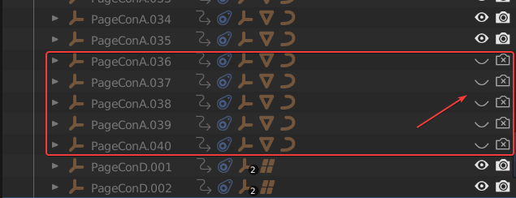
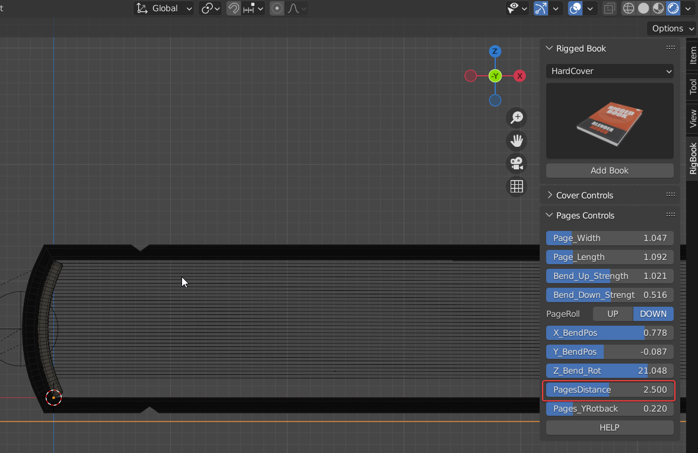

# Custom page number

**To be clear, the maximum number of pages in this addon is 100, which means a book with 100 pages (pages 1-200) 。**

Depending on my actual needs,most of the time I don't require very precise page numbers, . It's only a matter of thickness.。

But if you really need it, here's how to do that。

First choose a preset that is larger but closest to the number of pages you need. For example, if you need 35 pages, choose a preset of 40 pages.

In collection HC(40)，find five null objects from PageConA.036 to PageConA.040，press down the Shift  key on your keyboard，turn off the **Hide in ViewPort** and **Disable in Renders** buttons,it will hide the null objects and the objects under them。

Then select the book's controller and adjust the page distance under Pages Controls panel to match the book's height.

