# Overviews
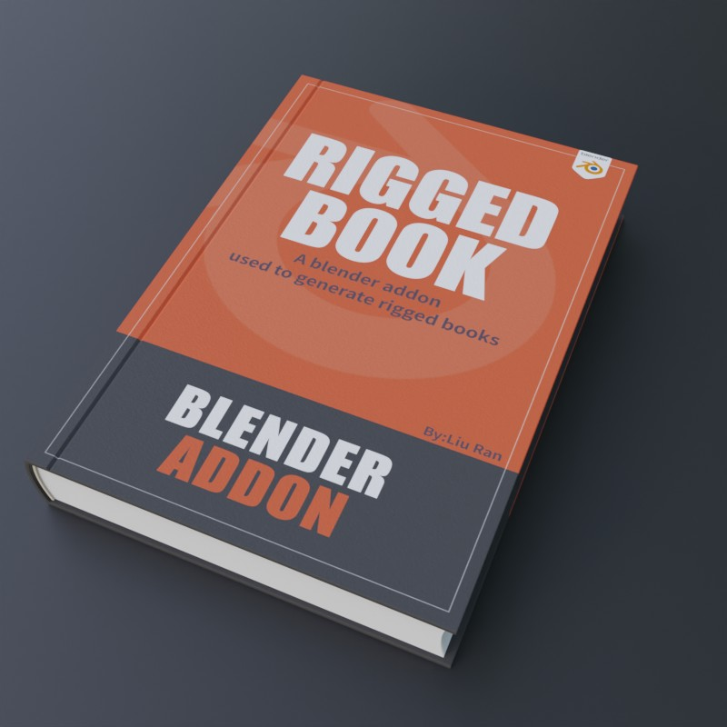{: width="400" }

**Riggedbooks is an addon for blender  to create  animation books in a fast way。**

**feature：**

-   **Two cover types: **：hard cover and soft cover. 
 
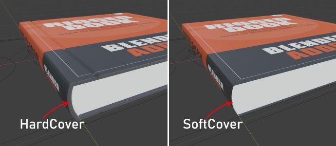
-   **The pages aren't interspersed**：No interlacing problems when turning pages. 
 
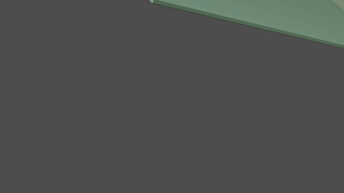 
- **Each type contains multiple page presets (P for pages) ：**10P，20P，30P，40P，50P，60P，80P，100P。      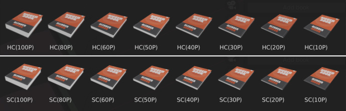
- **Parameters that can be customized：**
 
       Cover's height, width, length.
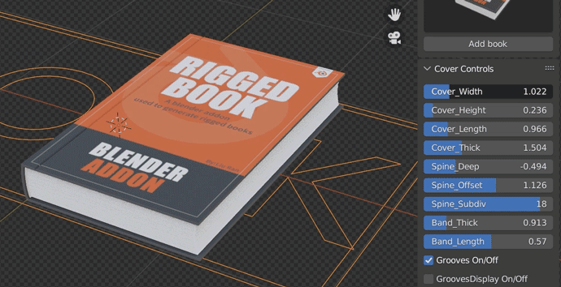 

    Cover thickness and the curvature of the spine.
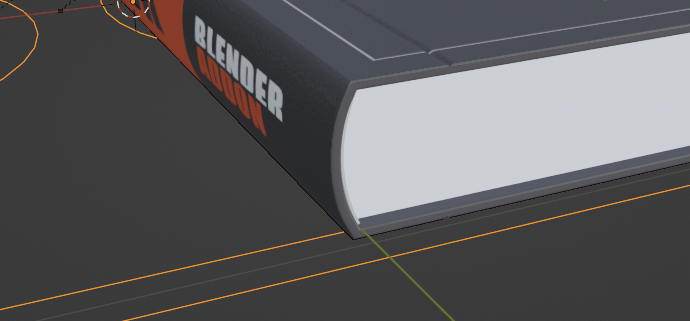 

     Customize the pages' bending shape.  
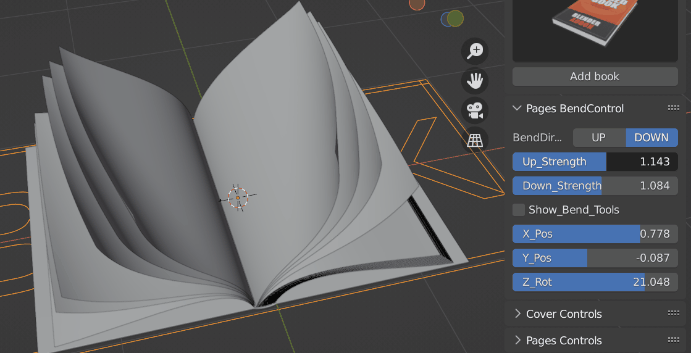 
   
  
- **Uneven effect of the pages:** adjust the page control's random strength can achieve the pages' uneven effect.
 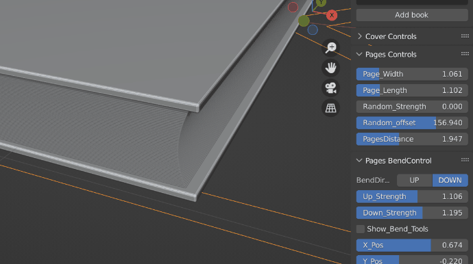  
     
- **Arch control panel:** Can adjust the relax strength of the pages on both sides in the opening state.
 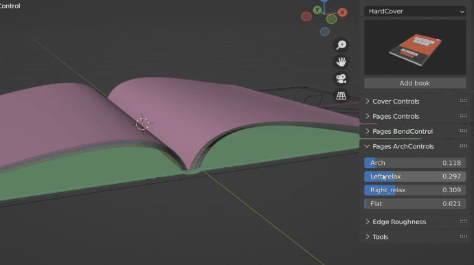  
     

- **All materials of the book can be customized:**Simple and intuitive.
   
  **Cover materials:**  
  Full controls for cover's front,spine,back,rim,inner materials.
  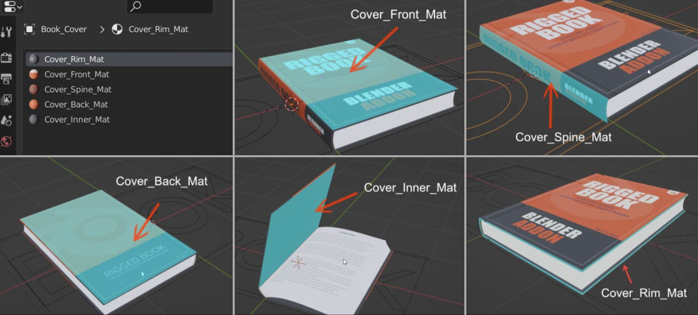  
  **Pages' materials:**  
  Every page has its material,and every material gets two image nodes for the page's front side and back side.
  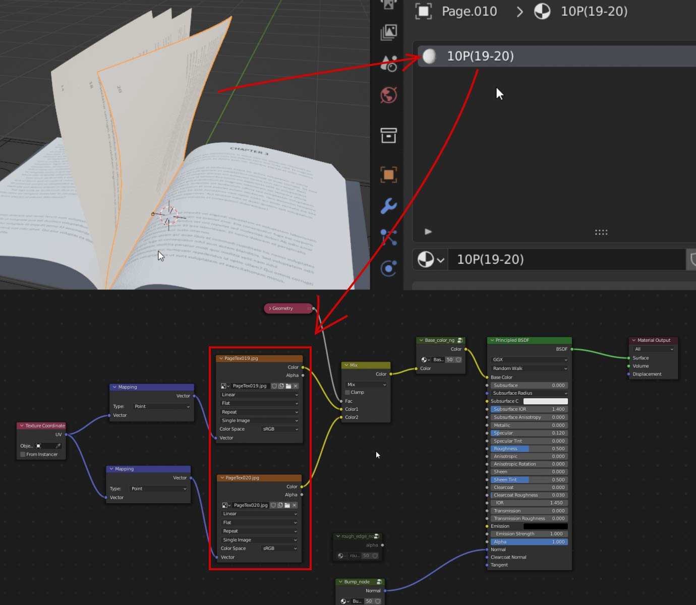    
   
  - **One click to batch replace all textures:** Prepare your map and name it according to a specific rule,then you can batch replace all textures with one click.
   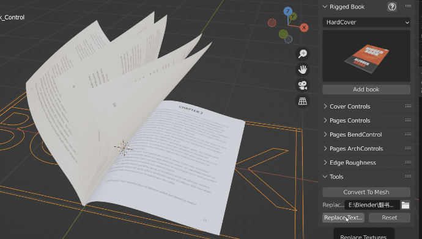  
  
- **One click to achieve the rough edge effect:**  
Can be used to make a damaged page, and provides a number of parameters, which can adjust the edge strength, width, roughness, details.
 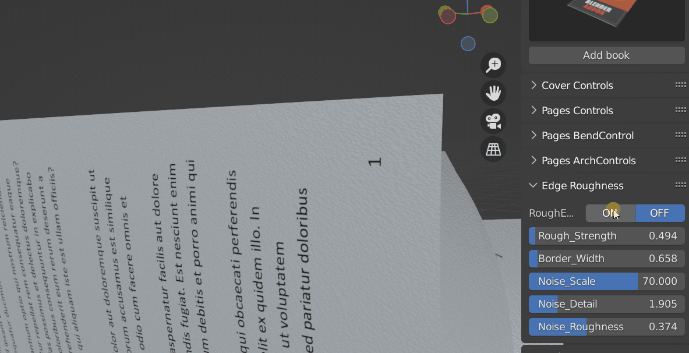  
   
- **The book's cover and each page gets its own  keyframes:**  
It is very convenient and intuitive to adjust the book's flip animation.
 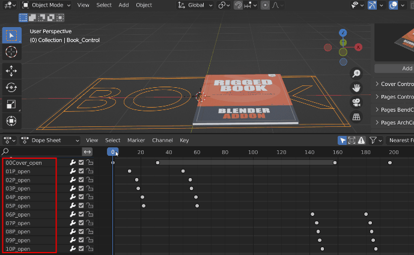  
     
- **One click to turn the book's animation state into a static model。**    
 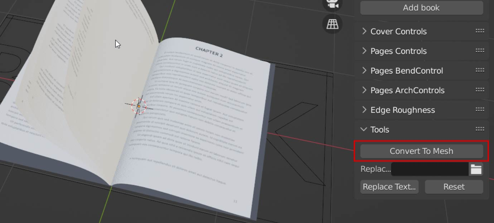    
  
 

- **Online manual and video tutorials:**  
   
  
!!!note
		This plugin has a maximum of 100 page models and a maximum of 200 page textures.