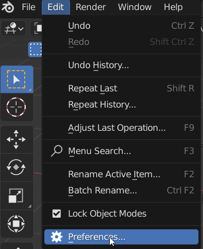
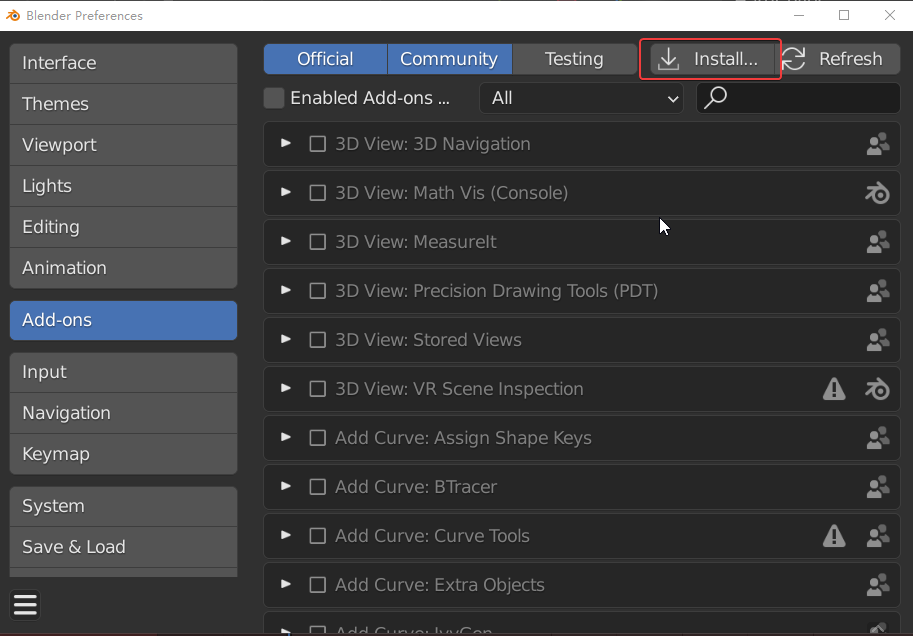
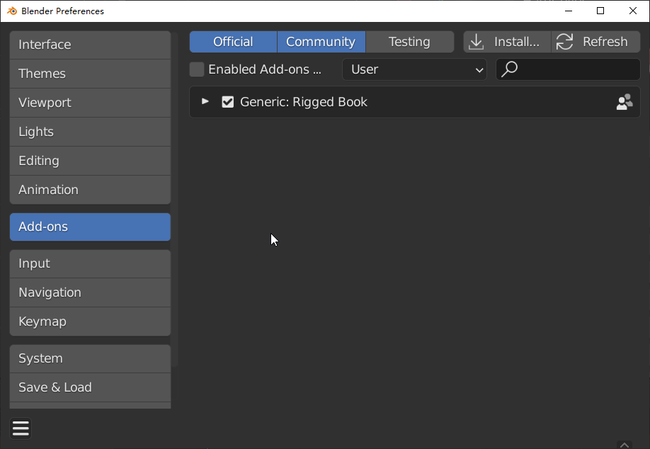
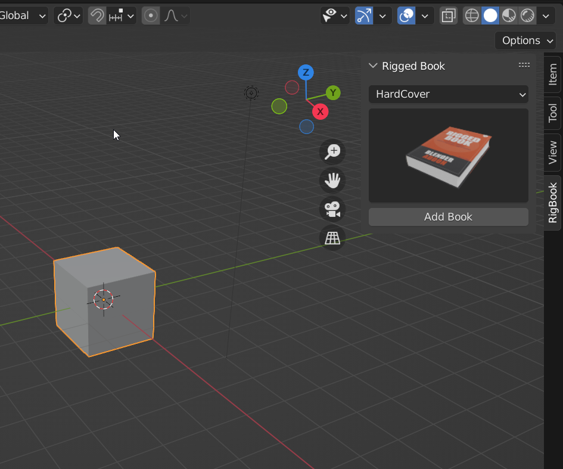

# Install

Same as all Blender addon installations.。  
Open panel :**Edit>>Preferences**

In the **Add-ons** column, click **Install**, then select the plug-in zip pack to Install

Enable the Addon。

Then you can see it on the N-panel。

!!!note
	Of course，You can also simply copy the unzipped folder to Blender's addon folder and enable it. (yourname depends on your username)   
	C:\Users\“**yourname**”\AppData\Roaming\Blender Foundation\Blender\3.0\scripts\addons

**unstall**  

1.Disable the add-on and save the user preferences.  

2.click the  remove button。