#Parameters

##CoverControls Panel：

 **Cover_Width：**Cover width

**Cover_Height：**Cover_Height

**Cover_Length：**Cover_Length
 
**Cover_Thick：**Cover_Thick

**Spine_Deep：**The depth at which the spine protrudes or depresses  
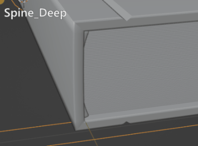	

 **Spine_offset：**Offset of Spine's subdivision (note that you can adjust this value if the cover is found to be broken during page turning)   
 
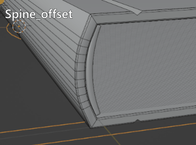
	
**Spine_subdiv：**The subdivisions of the spine.
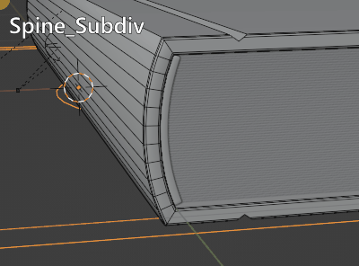
	
**Band_Thick：**The thickness of the band.   
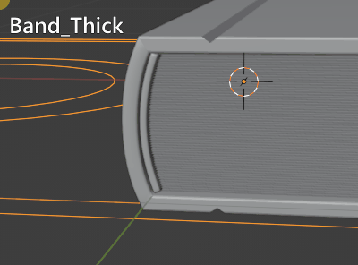

**Band_length：**The length of the band

**Grooves On/Off：**turn on or off the book cover groove effect.

**GroovesDisplay On/Off：**Control whether the book cover groove model is displayed. The groove is made by a cube and the cover with a boolean modifier. After the groove model is displayed by this switch,you can customize the shape of the grooves.

**Nulls_display：**Null controllers for rigging,you may never use them.

---

##PageControls Panel

**Page_Width:**The width of the pages

**Page_Length：**The Length of the pages

**Random_strength:**Control the strength of the page to produce a ragged effect.
  
 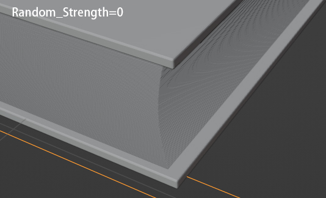{width=49%} 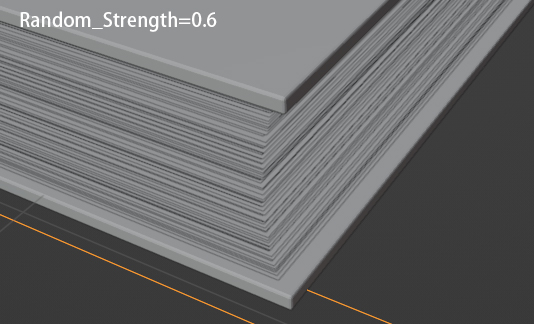{width=49%}

**Random_offset:**the offset of the pages' randomness。

**PagesDistance:**distance between every page.

---
##Pages BendControl Panel
 **BendDirection:** control whether the bend effect happens on up or down section of the pages.
 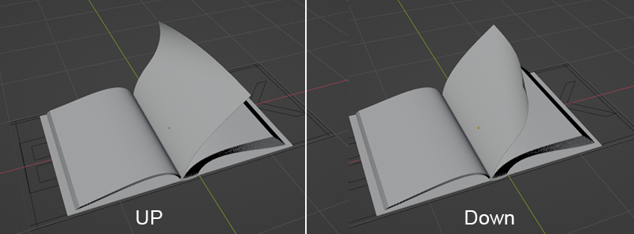
 
 **Bend_Up_Strength：**The strength of the bending of all the pages when turned over
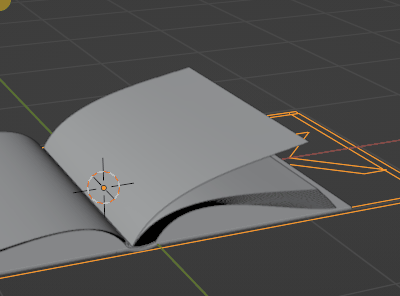

**Bend_Down_strength**：The strength of the bending of all the pages when they fall
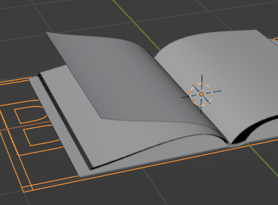

  **Show_Bend_Tools：**Whether to display the controllers associated with Page bending
  
You'd better turn on the **Show_Bend_Tools** when you adjust the following three parameters：

 **X_Pos:**the X positon of the bend modifier
 
 **Y_Pos:**the Y positon of the bend modifier
 
**Z_Rot:**the Z rotation of the bend modifier

---

##Pages ArchControls Panel
**Arch:**use this parameter to press down the middle part of the book when it is opened。
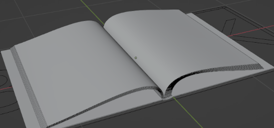

**Left_relax:**loose the left side of the pages when the book is opened。  
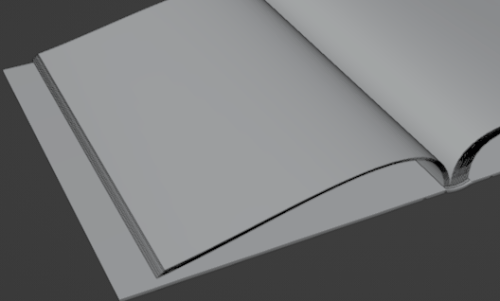

**Right_relax:**loose the right side of the pages when the book is opened.Because of the binding methods, the left side is also affected when the right side is relaxed, and these two parameters are used together as appropriate. 
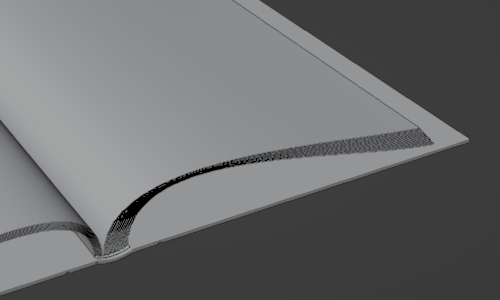

**Flat:**Its effect is similar with the arch parameters，but they works different.

---

##Edge Roughness Panel
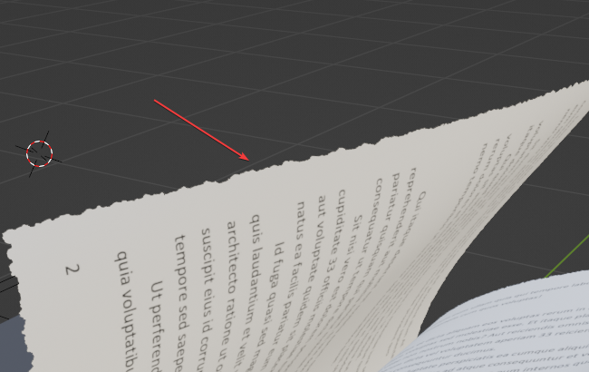{width=100%}

**RoughEdge:ON/OFF**: The page material's alpha channel is connected to a node group which controls the damage effect of the page, this switch is used to enable or disable the node groups. If you delete the node group, the parameters for roughedge on the plug-in panel will not work.
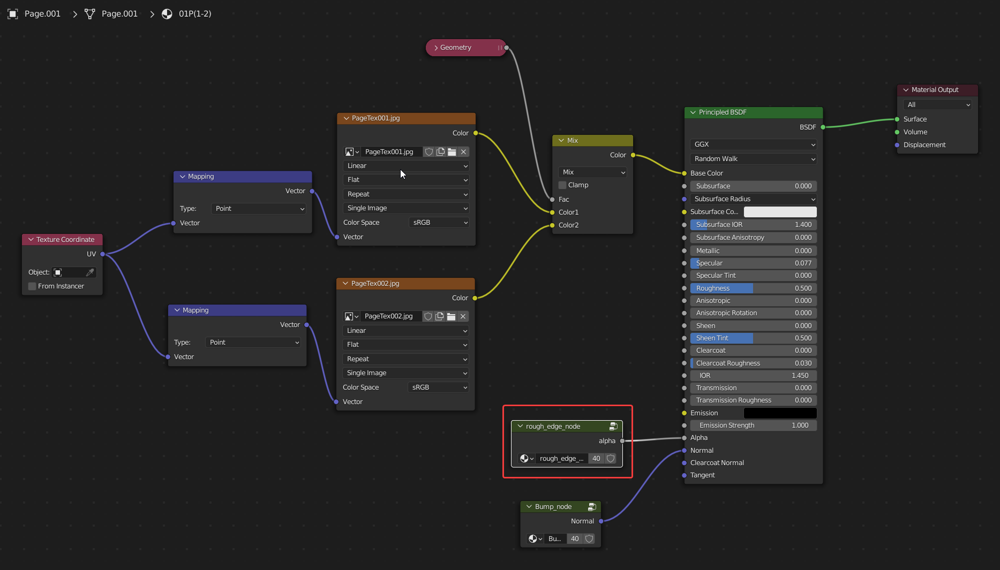

**Rough_Strength:**The strength of the roughedge。

**Border_Width:**The width of the roughedge。

**Noise_Scale:**Edge rough is based on a noise texture, this parameter controls the size of the noise texture.

**Noise_Detail:**detail of the noise texture。

**Noise_Roughness:**roughness of the noise texture。

---
##Tools
**Convert To Mesh:**Convert the current state of the animation book into a static model。

**Replace tex:**The path of your textures。  

**Replace Texture:**button for replace。
!!!How to use
	Rename your cover textures as**Cover_Front_Tex，Cover_Spine_Tex,Cover_Back_tex**，  
	Rename your pages as **PageTex001，PageTex002，PageTex003，...,PageTex200**，  
	Make sure the textures are placed under the replacement path, and then click the replace button to replace them in batches.

**Reset:**Resets the map. Resets all maps to the preset map.

