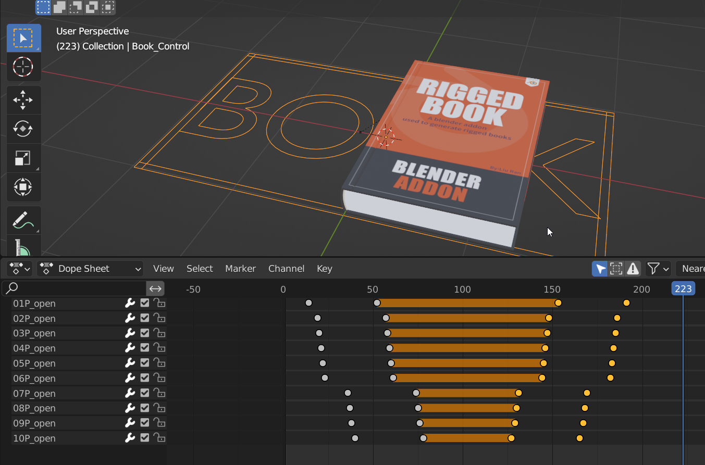

# Questions

###❓Why the most number is 100？ 
I can do more, but I don't think it is necessary, because most of the time artists only care about the thickness of the book.

###❓Compatible with Eevee and Cycle？ 
Yes。
	
###❓Is it used the geometry node？ 
no，It's all basic constraints and code.
	
###❓Can I use other render engines？ 
yes，but you should change materials yourself，but in other render engines,the parameters about roughness will not work.
	
###❓Will there be more updates？ 
I still have some ideas, but they're difficult to implement, and I'd be happy to update them once the problem is resolved. 
Of course, if there are bugs in the current version, I will try my best to fix them.
	
###❓How to convert it to a static model？ 
Select the controller，then press the convert to mesh button。

###❓Why the name of the 100p's control is 99p(100)？ 
Because 100P will upset the order。

###❓How to add 3D texts to the cover？ 
When the book is closed, find the null object named Cover_Rot_ConD,under it there is a Cover_Up_Null object,you can select the text object,then press shift and drag it to the Cover_up_Null object make the text a children of the Cover_Up_Null object.

###❓How to get it back when you accidentally delete a keyframe? 
Select the controller, in the controller's custom properties, there are all parameters, find the required parameter to key frame。

###❓How to make a cover flip back animation? 
Delete the keyframes in the end. Mirror the front keyframes.

