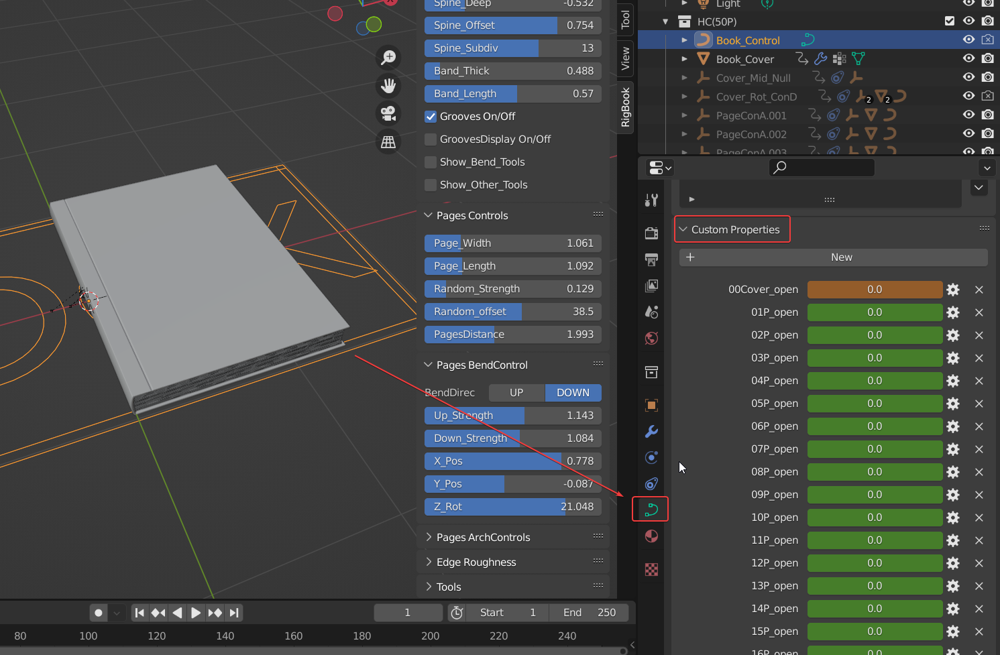

# Questions

###❓About adjusting the curvature of the book spine？ 
Problem description: the cover spine and pages will interlaing when you increase the spine offset

Find a null object in the middle of the spine cover ,it  is used to control the deep offset of bind and pages,it can be moved left and right ,then you will solve the prolem

###❓How to transform the book？ 
**[Transform](transform.md)**

###❓How to reduce the number of pages？ 
Video tut:[https://youtu.be/VriFDudqick](https://youtu.be/VriFDudqick)

###❓Why the most number is 100？ 
I can do more, but I don't think it is necessary, because most of the time artists only care about the thickness of the book.

###❓Compatible with Eevee and Cycle？ 
Yes。
	
###❓Is it used the geometry node？ 
no，It's all basic constraints and code.
	
###❓Can I use other render engines？ 
yes，but you should change materials yourself，but in other render engines,the parameters about roughness will not work.
	
###❓Will there be more updates？ 
I still have some ideas, but they're difficult to implement, and I'd be happy to update them once the problem is resolved. 
Of course, if there are bugs in the current version, I will try my best to fix them.
	
###❓How to convert it to a static model？ 
Select the controller，then press the convert to mesh button。

###❓Why the name of the 100p's control is 99p(100)？ 
Because 100P will upset the order。

###❓How to add 3D texts to the cover？ 
When the book is closed, find the null object named Cover_Rot_ConD,under it there is a Cover_Up_Null object,you can select the text object,then press shift and drag it to the Cover_up_Null object make the text a children of the Cover_Up_Null object.

###❓How to get it back when you accidentally delete a keyframe? 
Select the controller, in the controller's custom properties, there are all parameters, find the required parameter to key frame。

###❓How to make a cover flip back animation? 
Delete the keyframes in the end. Mirror the front keyframes.

###❓Blender crashed when playing open animation？ 
In my tests so far, I only found that blender crashes when the wiggle bone addon is turned on at the same time.
So,if Blender crashed when playing open animation ,be sure to check if the wiggle bone addon is turned on.

###❓"Replace textures" not work？ 
1. check the texture's format: jpg
2. check the textures' name: PageTex001.jpg，   PageTex002.jpg，  ...... PageTex199.jpg， Cover_Front_Tex，Cover_Spine_Tex,Cover_Back_tex
3. Check that the controller is selected before executing the command
4. still not work,click the reset button ,and try it again
5. still not work,contact me (547198894@qq.com):send some screenshots of your blender file and rename folder to me .

###❓How to export Book animation to other 3d softwares？(unity,c4d,max,maya,......) 
Video Tut：[https://youtu.be/Q0eA1I7yfqg](https://youtu.be/Q0eA1I7yfqg)

