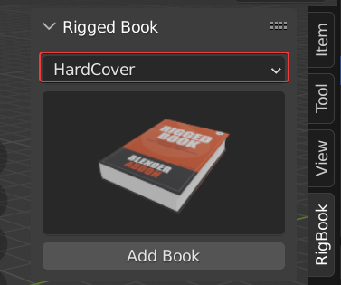
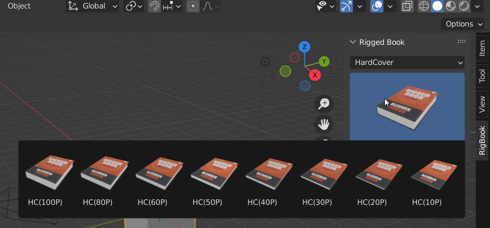
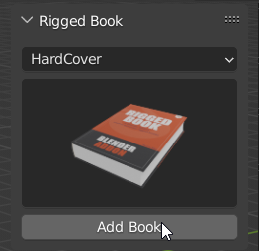
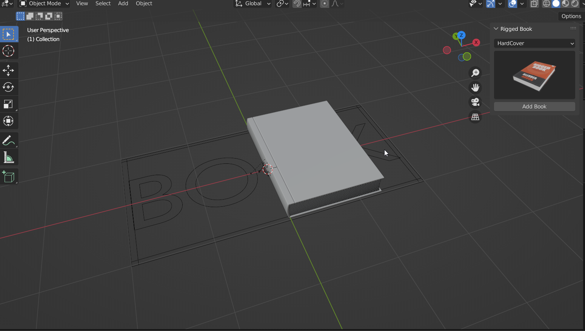
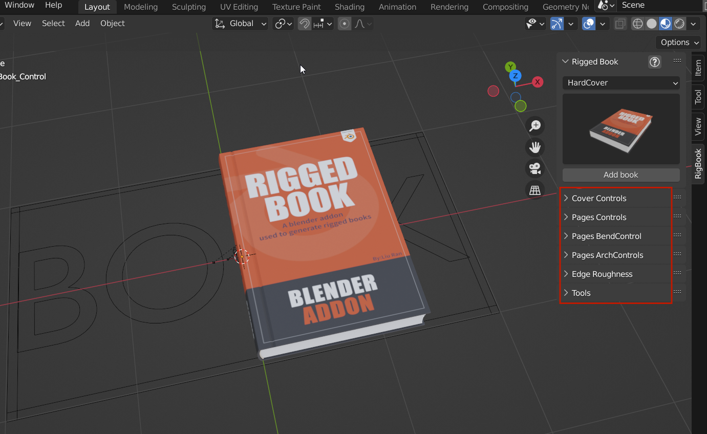

# Quickstart

open the N-panel，you can find the rigbook plugin。  
First select in the type of book you want to make, hard or soft。

Click on the thumbnail of the book, then pop up a row of presets,select the number of pages you want (P stands for pages) 。  
!!! Note
    Most of the time you only need to determine the approximate thickness of the book,.
	But if the number of pages you need is accurate, choose an option that is more than the number of pages you need, and hide the extra page model in the outline.。
		

Once selected, click the AddBook button to add a book to the view。  

Select the controller that has the Book text on it, and there will be many control bars on the right. expand to see all the control parameters related to the Book.。

Play，you can see the flip animation。

!!! Note
	You can find out exactly what all the parameters do on the  ** [ Parameter ](parameters.md ) ** page。And how to keyframe the animations on the **[Animation](animations.md)**  Page.

