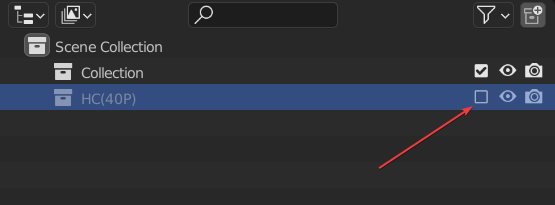
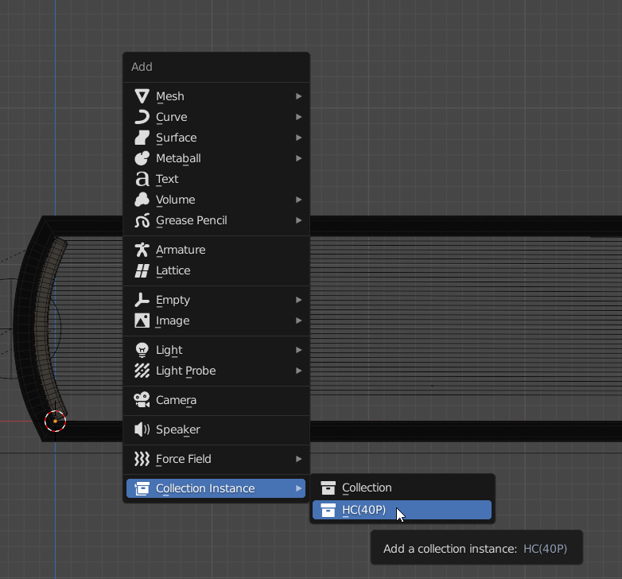
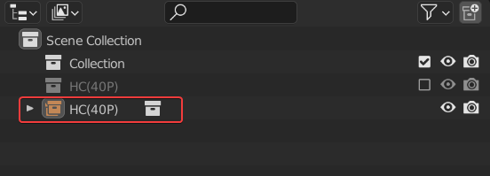
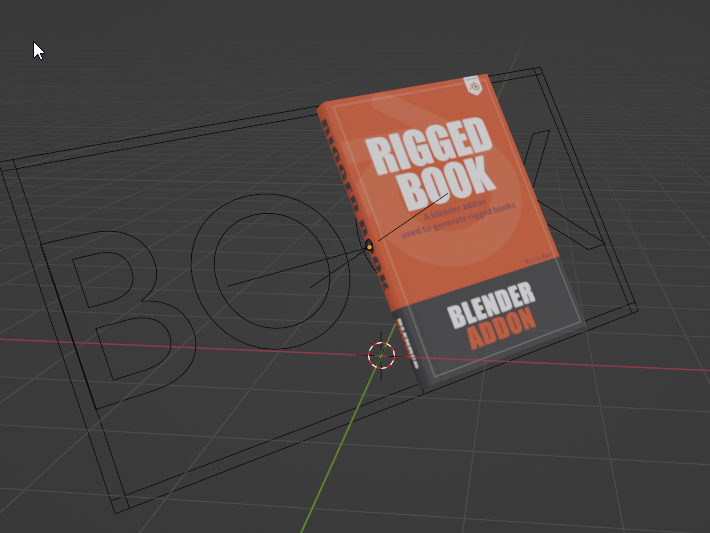

# Transform、Rotate、Scale
!!! Note
	Due to binding constraints, the controller can not be used directly for transformation. We should use a special method。  
	  
First, close the book collection。

Then Press Shift + a in the viewport, and find the Collection Instance to create an Instance of the Collection.。

Then you will get an instance of the book.

You can transform the book instance。This instance will inherit the materials and animations of the original collection。

